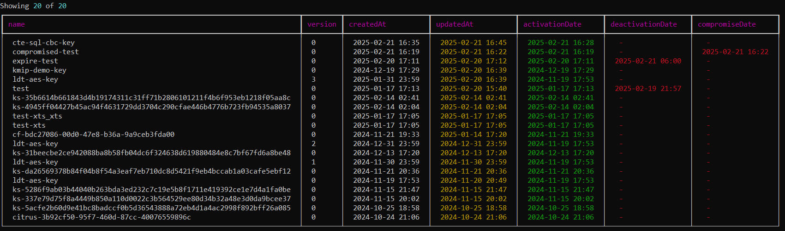
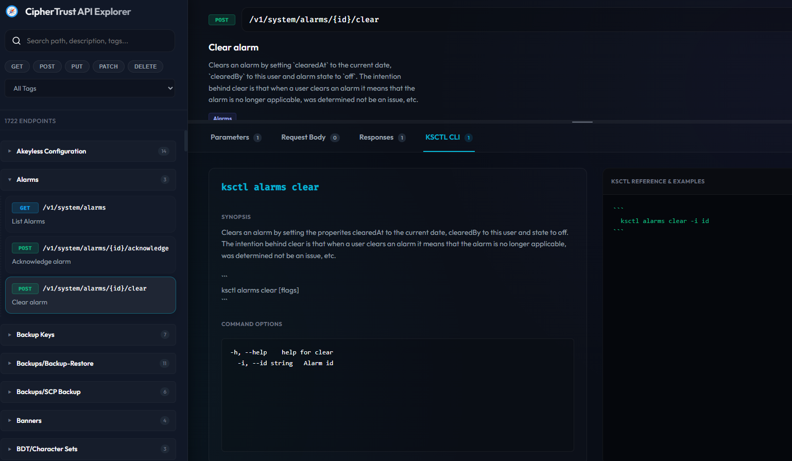
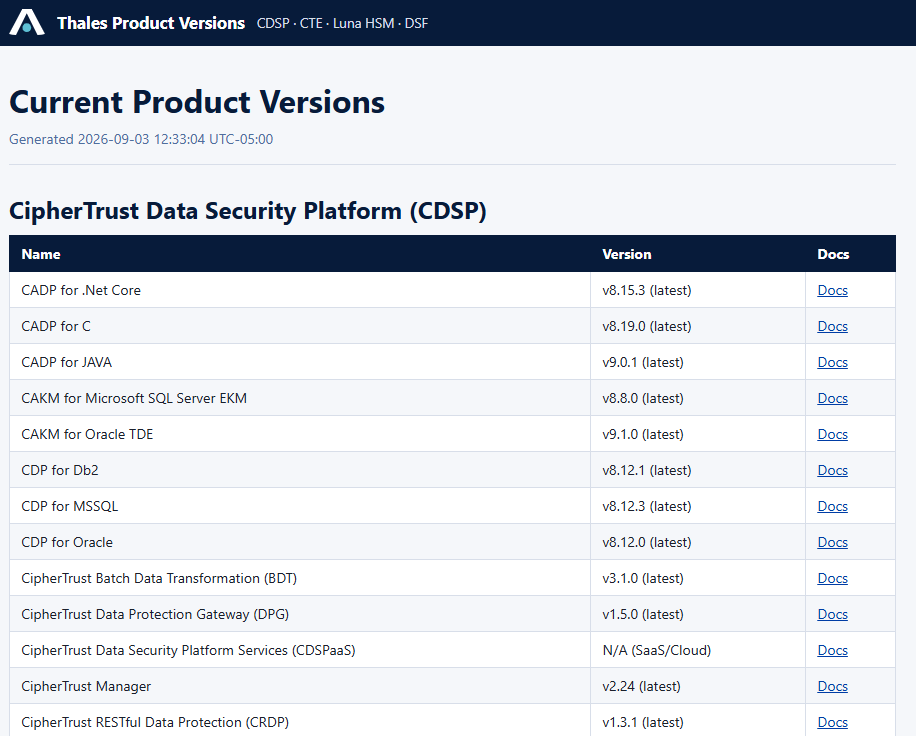

# Projects

A collection of utilities, tools, and projects.

## Projects

- **[cminfo](./cminfo/)**  
Python CLI that presents CipherTrust Manager information (keys, users, CTE clients, alarms, services, and more) in readable, formatted output instead of raw `ksctl` JSON.  
  

- **[ct-explorer](./ct-explorer/)**  
Client-side SPA for browsing, searching, and analyzing the CipherTrust Manager OpenAPI spec, with endpoints mapped to their `ksctl` CLI equivalents.  
  

- **[get-current-versions](./get-current-versions/)**  
Scrapes, tracks, and logs latest versions for Thales CipherTrust (CDSP), CipherTrust Transparent Encryption (CTE), Luna HSM, and Data Security Fabric (DSF) products.  
  

